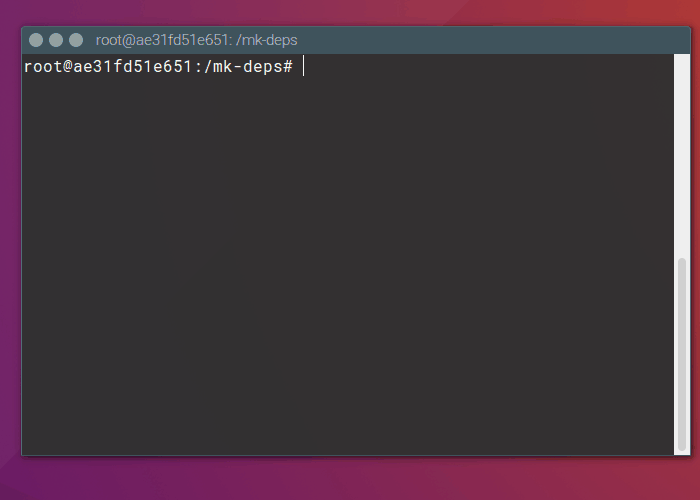

# mk-deps

Cli tool for installing runtime dependencies of a debian package



## Purpose

If you want to extend the source code of debian package you need the runtime dependecies
of that package. `mk-deps` was created to easily install the runtime dependencies, without
installing the debian package itself.

## Usage

You can use mk-deps in your shell after the [installation](#installation).

```bash
mk-deps [OPTIONS]
mk-deps install debian/control
mk-deps install debian/control -p {PACKAGE_NAME}
```

## Installation

### From Source

1. Clone the repository
2. Run the following commands

```bash
sudo apt-get install fakeroot dh-make build-essential devscripts # Packages nessesary for building package python3-all python3-pytest python3-click
sudo pip3 install wheel click-man
cd mk-deps/debian
debuild -us -uc # Build the package
sudo dpkg -i ../mk-deps*.deb # Install the package
```

3. To enable autocompletion, run `source /usr/share/bash_completion/completions/mk-deps-complete.sh` or open a new shell

### Try it out with docker

Use the Docker file to create your image and play around with mk-deps, without polluting
your main system.

1. Install Docker, following the instructions https://docs.docker.com/engine/installation/
2. Build your docker image: `docker build --pull -t $USER/mk-deps .`
3. Create a container from this image: `docker run -t -i $USER/mk-deps bash`
4. Play around `mk-deps install tests/input/tsp-web.control`

## Limits

Some packages use variables inside runtime dependencies. mk-deps is (yet) not
able to get the value of these variables.
